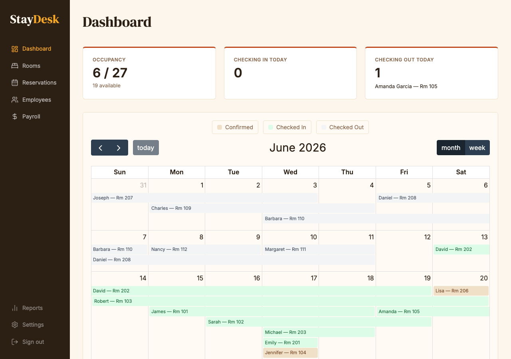

# StayDesk System Overview

**Version 1.0 · Martin House**

StayDesk is the property management system for Martin House. It handles reservations, guest check-in and check-out, payment collection, and end-of-period reporting — all from a single browser-based interface.

---

## Modules

| Module | What it does |
|--------|-------------|
| **Reservations** | Create, view, and manage guest bookings |
| **Check-In / Check-Out** | Process arrivals and departures, collect payment |
| **Guest Folio** | Itemised record of charges for each stay |
| **Reports** | Occupancy and revenue summaries |

---

## Logging in

All staff access StayDesk with a **username and PIN** assigned by management. There is no password reset self-service — contact your manager if you are locked out.

*The StayDesk login screen.*

---

## Navigation

After logging in you land on the **Dashboard**, which shows the property calendar. The sidebar on the left gives access to each module.

*The main dashboard. The sidebar links to each module.*

---

## Roles

| Role | Access |
|------|--------|
| **Front Desk** | Reservations, check-in/out, payments |
| **Admin** | All of the above plus reports and staff management |

---

## Getting help

If something looks wrong or you are unsure how to proceed, contact your manager before making changes. Do not attempt to delete reservations or guest records without manager approval.
