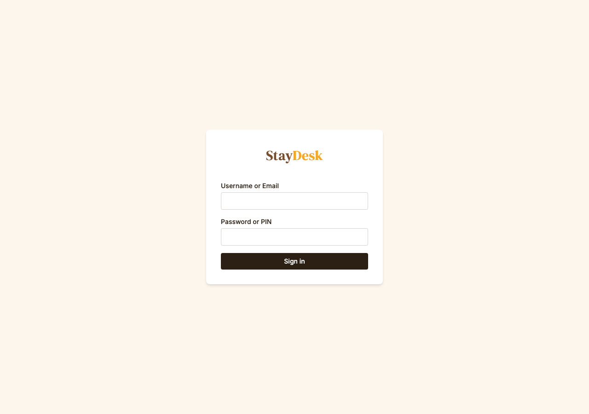

# Logging In

## What you need

- The StayDesk URL provided by your manager
- Your **username** and **PIN** (assigned by management)

---

## Steps

1. Open a web browser and navigate to the StayDesk URL.
2. Enter your **username** in the first field.
3. Enter your **PIN** in the second field.
4. Click **Sign In**.

*Enter your username and PIN, then click Sign In.*

---

## After signing in

You will land on the **Dashboard**. If you see a "Invalid credentials" message, double-check your username and PIN. PINs are case-sensitive numbers — make sure Caps Lock is off.

---

## Logging out

Click your name or the user icon in the top-right corner, then select **Sign Out**. Always log out when stepping away from a shared computer.

> **Note:** Sessions expire automatically after a period of inactivity. You will be returned to the login screen and will need to sign in again.

---

## Trouble logging in?

Contact your manager. Do not share your PIN with other staff members.
