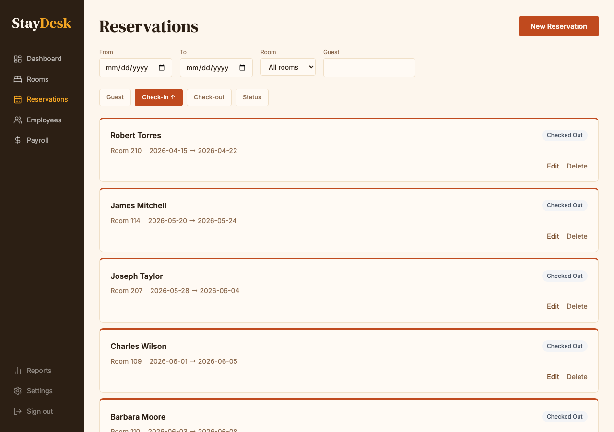
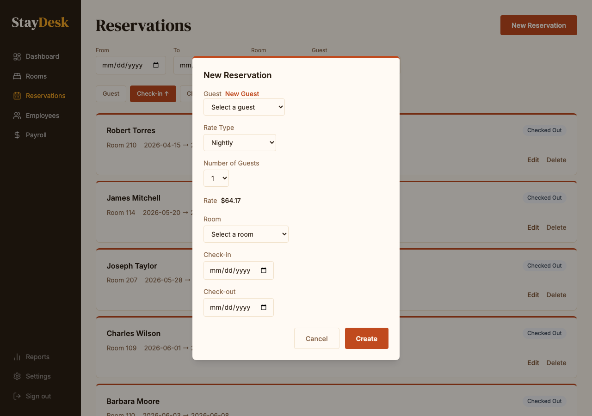

# Managing Reservations

Reservations track a guest's intended stay before they arrive. A reservation is created when a guest books a room and is converted into an active stay at check-in.

---

## Viewing reservations

From the sidebar, click **Reservations**. The page shows all reservations in a sortable list. Use the filters at the top to narrow by date range, room, or guest name. The status badge on each row shows where the guest is in their stay.

| Status | Meaning |
|--------|---------|
| Confirmed | Booking made, guest not yet arrived |
| Checked In | Guest is currently in the room |
| Checked Out | Stay complete |
| Cancelled | Reservation was cancelled |

*The reservations list with filters and sort controls.*

---

## Creating a new reservation

1. Click **New Reservation** (top-right button) or click an empty date block on the calendar.
2. Fill in the guest details:
   - First and last name
   - Contact phone number
   - Check-in and check-out dates
   - Room number
   - Number of guests
3. Review the **nightly rate** and **total** calculated at the bottom.
4. Click **Save Reservation**.

*Complete all required fields before saving.*

> **Card collected at booking:** A card is captured when the reservation is created. The guest will not be charged until check-out unless they cancel inside the cancellation window.

---

## Editing a reservation

1. Click the reservation block on the calendar.
2. Click **Edit** in the detail panel.
3. Make your changes and click **Save**.

> **Note:** Changes to dates or room may affect the total. Confirm the updated total with the guest before saving.

---

## Cancelling a reservation

1. Open the reservation detail panel.
2. Click **Cancel Reservation**.
3. Confirm the cancellation in the dialog.

Cancellations are logged and cannot be undone. Contact your manager if a cancellation was made in error.
