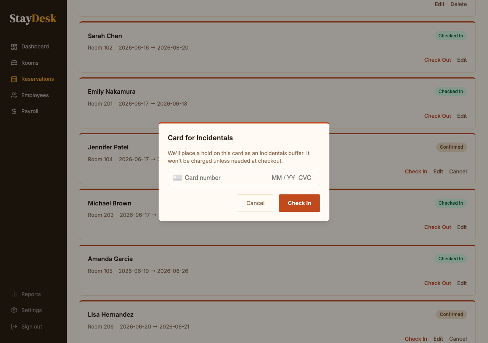

# Guest Check-In

Check-in converts a confirmed reservation into an active stay and activates the guest's room.

---

## Before the guest arrives

- Verify the reservation is in **Confirmed** status on the calendar.
- Confirm the room is clean and ready.
- Have the guest's ID ready to verify at the desk.

---

## Check-in steps

1. Locate the guest's reservation on the **Dashboard** calendar or search by name.
2. Click the reservation block to open the detail panel.
3. Verify the guest's name and ID.
4. Click **Check In**.
5. Confirm the check-in date and room in the dialog, then click **Confirm Check-In**.

*Enter the card for incidentals, then click Check In to confirm.*

The reservation status changes to **Checked In** (green on the calendar).

---

## Walk-in guests (no reservation)

1. Click **New Reservation** and complete the guest details as normal.
2. Set the check-in date to today.
3. Save the reservation, then immediately follow the check-in steps above.

---

## After check-in

- Issue the room key.
- Let the guest know the check-out time (11:00 AM by default).
- Remind them that their card on file will be charged at check-out.

> **If a room is not ready:** Do not check the guest in until the room is confirmed clean. Ask the guest to wait in the lobby and notify housekeeping.
