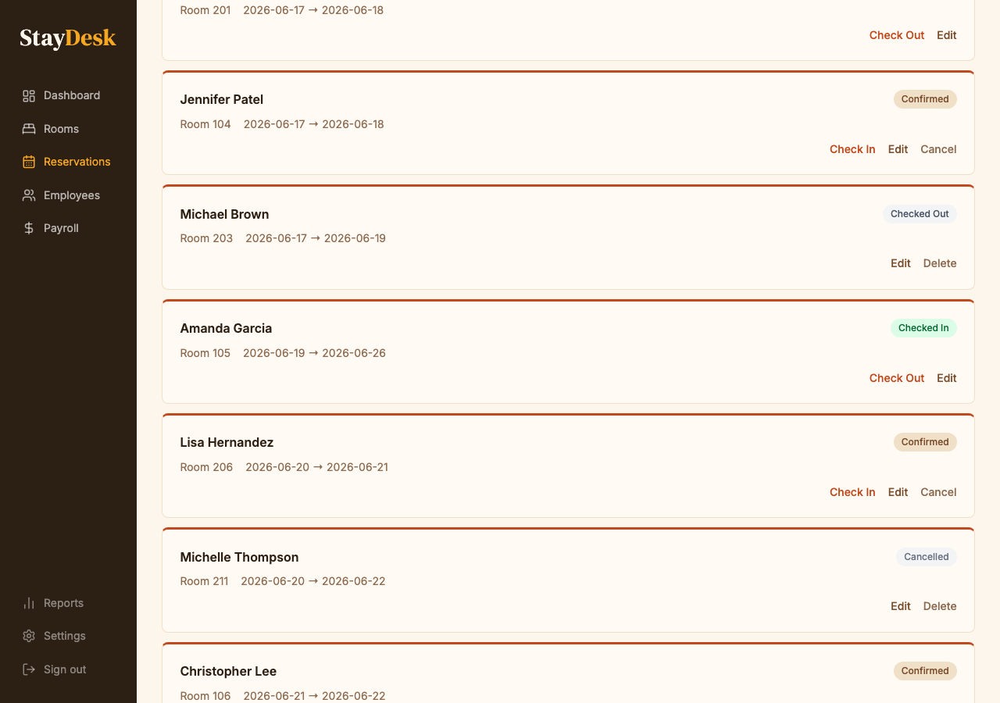

# Guest Check-Out

Check-out closes the guest's stay, charges the card on file, and marks the room as available for cleaning.

---

## Standard check-out steps

1. Locate the active stay on the **Dashboard** calendar (green block) or search by name.
2. Click the reservation block to open the detail panel.
3. Review the **folio** — confirm all charges are correct.
4. Click **Check Out**.
5. The system will display the total due and the card on file.
6. Click **Confirm & Charge** to process payment.

*Click Check Out from the reservation row to begin.*

*The folio shows all charges. Click Capture Payment to charge the card on file.*

A payment receipt is generated automatically. The room status changes to **Checked Out**.

---

## Late check-out

Standard check-out time is **11:00 AM**. If a guest requests late check-out:

- Check availability for the room.
- Manager approval is required for late check-out beyond 1:00 PM.
- Late check-out fees, if applicable, must be added to the folio before check-out.

---

## Early departure

If a guest checks out before their scheduled date:

1. Open the reservation detail panel.
2. Click **Edit** and update the check-out date to today.
3. Save the change, then follow the standard check-out steps.

> **Note:** Early departure may affect the total. Confirm the adjusted amount with the guest before processing.

---

## After check-out

- Collect room keys.
- Notify housekeeping that the room is ready for cleaning.
- The room will appear as available on the calendar once housekeeping marks it clean.

---

## Payment declined

If the card on file is declined:

1. Inform the guest politely that the card was not accepted.
2. Ask for an alternate form of payment.
3. Do not release the room key for a new guest until payment is resolved.
4. Contact your manager if the issue cannot be resolved at the desk.
