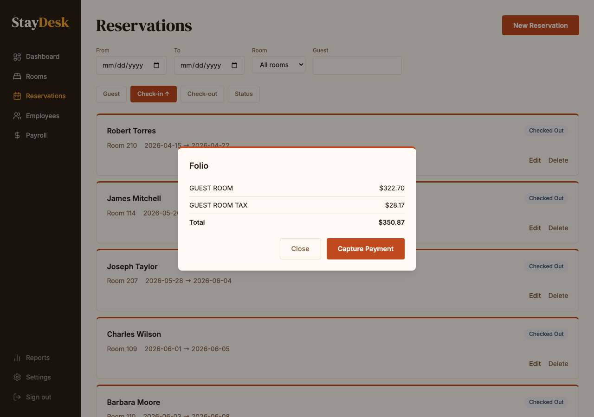

# Payments

StayDesk processes all payments through **Stripe**. No card numbers are handled or stored by the front desk — the system manages this securely in the background.

---

## How payment works

| Event | What happens |
|-------|-------------|
| Reservation created | Card is captured and held (not charged) |
| Check-out | Full balance is charged to the card on file |
| Declined card | Front desk is prompted to collect alternate payment |

---

## Viewing a guest's payment details

1. Open the reservation from the calendar.
2. The **folio** section shows all charges and the card on file (last 4 digits only).

*The folio shows each charge and the masked card number.*

---

## What front desk staff can do

- **View** the card on file (last 4 digits and card type only).
- **Process check-out** charges.
- **Record cash payments** if a guest pays with cash (contact manager for this workflow).

## What front desk staff cannot do

- View full card numbers — this is by design for security.
- Issue refunds — contact your manager.
- Change or override the nightly rate — contact your manager.

---

## Receipts

A payment receipt is generated automatically at check-out. If a guest requests a copy:

- The receipt is accessible from the completed reservation detail panel.
- Print directly from the browser or save as PDF.

---

## Refunds and disputes

Refunds must be processed by a manager. If a guest disputes a charge, collect their contact information and let your manager know immediately. Do not promise a refund without manager approval.
