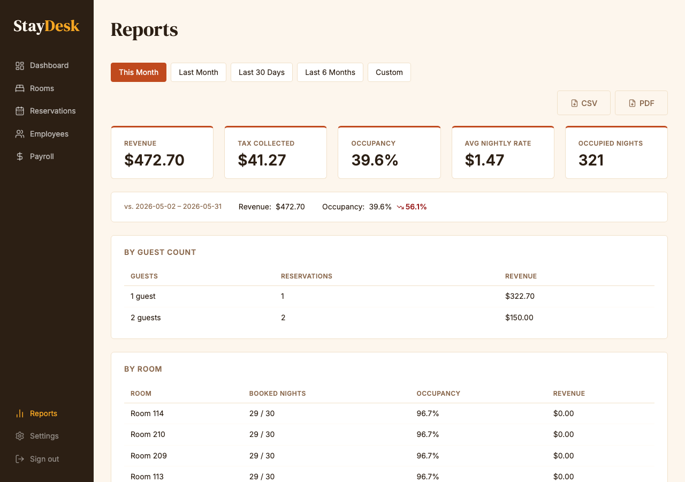
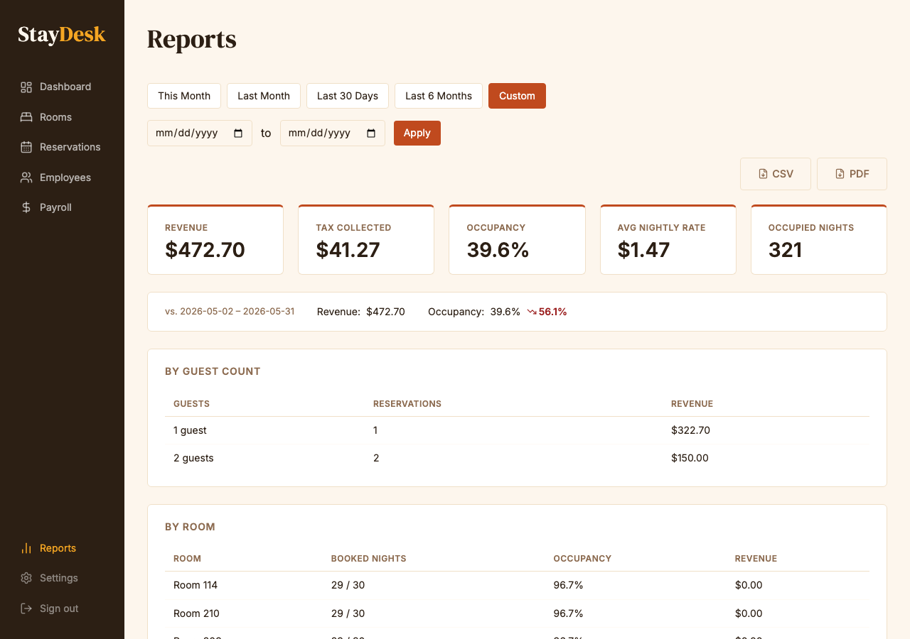

# Reports

The Reports module is available to **Admin** users. It provides occupancy and revenue summaries that can be exported as CSV or PDF.

---

## Accessing reports

From the sidebar, click **Reports**.

*The reports page showing occupancy and revenue summary.*

---

## Available data

| Metric | Description |
|--------|-------------|
| **Occupancy rate** | Percentage of rooms occupied over the selected period |
| **Total revenue** | Sum of all charges collected |
| **Rooms occupied** | Count of room-nights with a checked-in guest |
| **Average nightly rate** | Revenue divided by rooms occupied |

---

## Filtering by date range

Click **This Month**, **Last Month**, **Last 30 Days**, or **Last 6 Months** for preset ranges, or click **Custom** to enter specific dates. The summary updates automatically.

*Preset range buttons and the Custom date picker.*

---

## Exporting

- Click **CSV** to download a spreadsheet of the raw data.
- Click **PDF** to download a formatted summary report.

The export buttons are in the top-right of the reports page (visible in the overview screenshot above).

---

## Common uses

- **End of month**: Run a full-month report for revenue reconciliation.
- **Owner review**: Export PDF for sharing with property ownership.
- **Occupancy trends**: Compare periods week-over-week to identify slow seasons.
